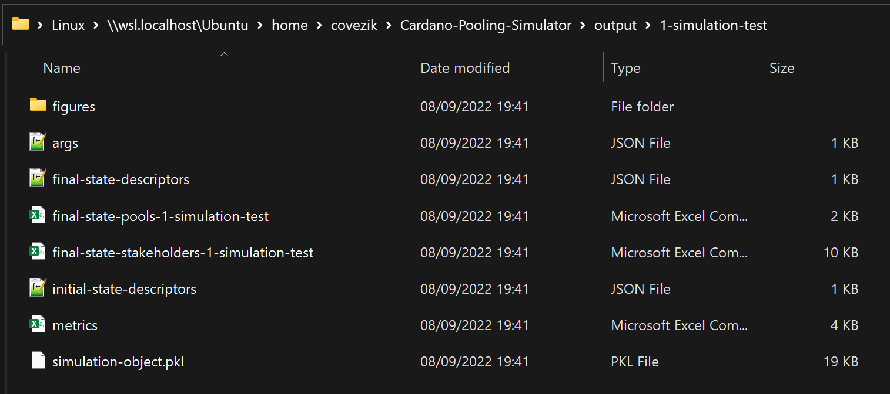
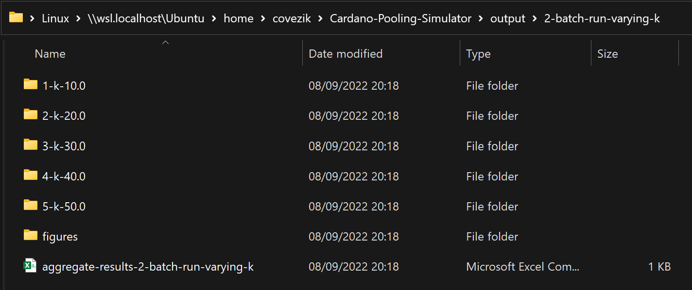

# Output
Every time the simulation engine is used, it produces some output files to describe the simulations that were executed. 
All these files are saved within a folder named “output”, which is created automatically if it doesn't already exist.

## Output from single run
Each execution of the simulation generates a new folder for the output of that specific execution. The folder is named 
based on the local serial number[^1] of the execution and a user-provided identifier (or an automatically generated one if 
the user does not define one for that instance).

Specifically, the folder is populated with the following:

### Files that characterize the input of the execution

- **args.json**: A json file that lists all the parameters of the simulation and the values they take during this 
execution.
- **initial-state-descriptors.json**: A json file that describes the initial state of the system for this execution, 
including the highest and lowest stake values owned by the stakeholders, the Nakamoto coefficient prior (how many 
stakeholders collectively control the majority of the stake before any pooling takes place), and more. The number that
was used as the seed for pseudo-randomness is also listed there, to allow for reproducibility of the results.

### Files that track the evolution of the execution

- **metrics.csv**: A csv file that reports various metrics for each round of the simulation (e.g. pool count or total 
pledge). The specific metrics that are tracked depend on the input of the simulation (see the relevant part of the
[Configuration](configuration.md) page for all options). 
- **Figures**: If the relevant option is activated (see [Configuration](configuration.md)), a graph is produced for each
tracked metric, illustrating its evolution throughout the course of the simulation.

### Files that characterize the outcome of the execution

- **final-state-descriptors.json**: A json file that describes the final state of the system for this execution, 
including the number of pools, the number of distinct operators, and more. It is also stated in this file whether the
simulation reached an equilibrium or not.
- **final-state-pools.csv**: A csv file that lists information about the pools that are active in the system upon 
termination of the simulation. This includes for each pool its owner's id, its pledge, total stake, profit margin, and 
more. 
- **final-state-stakeholders.csv**: A csv file that lists information about the stakeholders upon termination of the 
simulation. This includes predetermined attributes, like the initial stake or cost value of a stakeholder, as well as 
characteristics relating to the final state of the simulation, such as the number of pools they end up operating or the
total stake they control through their pools.
- **simulation-object.pkl**: A [pickled](https://docs.python.org/3/library/pickle.html) file containing the instance of 
the simulation as a Python object (only useful for developers that may want to use it to extract more data).

---

For example, running the simulation for the first time with "simulation-test" as the execution id produces a folder
that looks like this:

## Output from batch run
Similarly with the single run, each batch run execution generates a new folder, which is named based on the local serial 
number and a user-provided identifier (or the generic "batch-run" if the user does not define an id for that instance).
Within this folder, more folders are created, each corresponding to an instance of the simulation and having the format 
described above.

In the case of batch runs, one more file is created, which contains aggregate results (some metrics for each simulation 
instance) and is used to create graphs (saved under "Figures") and compare the different executions and the impact of the changing input.

For example, executing a batch run the second time the simulation engine is used, with "batch-run-varying-k" as the 
execution id produces a folder that looks like this:

[^1]: Keeping track of the serial number is done using a local file named "sequence.dat". 